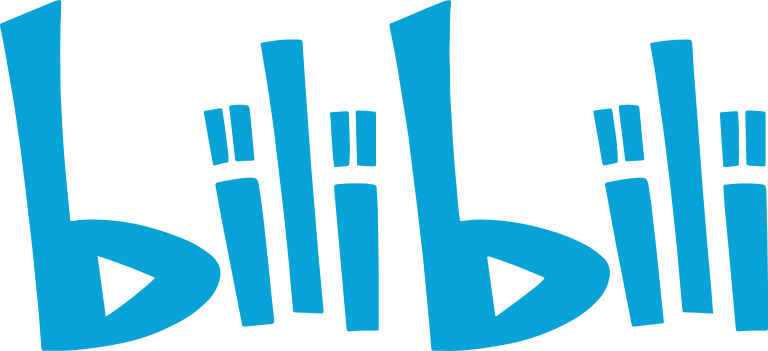

# An Introduction to Flutter Built-in Widgets

## Goals

- Know Common Flutter Built-in Widgets
- Can Develop Simple Page using Flutter Built-in Widgets
- Gain Knowledge of Flutter

## Pre Requirements

- Know a Programming Language
- Know Some Programming Tools

## Plan

- Learn Document of The Widget
- Learn Some Examples
- Exercise
- A Final Exam

## Table of Contents

### Before get started

- [Setup Flutter Development Environment](lib/src/flutter_develop_env.md) 👉  

### Content Widgets

- [Text](lib/src/content/text/README.md) 👉  
- [RichText](lib/src/content/text/README.md) 👉 
- [Icon](lib/src/content/icon/README.md) 👉 
- [Image](lib/src/content/image/README.md) 👉 
- [Badge](lib/src/content/badge/README.md) 👉 
- [Card](lib/src/content/card/README.md) 👉 
- [ListTile](lib/src/content/list_tile/README.md) 👉 

### Container Widgets

- [Container](lib/src/container/container/README.md) 👉 
- [Center](lib/src/container/container/README.md) 👉 
- [Align](lib/src/container/container/README.md) 👉 
- [SizedBox](lib/src/container/container/README.md) 👉 
- [DecoratedBox](lib/src/container/container/README.md) 👉 
- [LimitedBox](lib/src/container/limited_box/README.md)

### Layout Widgets

- [MaterialApp](lib/src/layout/materialapp/README.md) 👉 
- [Scaffold](lib/src/layout/scaffold/README.md) 👉 
- [Flex](lib/src/layout/flex/README.md) 👉 
- [Row & Column](lib/src/layout/flex/README.md) 👉 
- [Expanded](lib/src/layout/flex/README.md) 👉 
- [Flow](lib/src/layout/flow/README.md)
- [Wrap](lib/src/layout/flow/README.md)
- [Stack](lib/src/layout/stack/README.md)
- [Constraint](lib/src/layout/constraint/README.md)
- [LayoutBuilder](lib/src/layout/layout_builder/README.md)
- [BaseLine](lib/src/container/baseline/README.md)
- [NavigationBar](lib/src/layout/navigation_bar/README.md)

### Actions Widgets

- [Buttons](lib/src/actions/buttons/README.md)
- [GestureDetector](lib/src/actions/gesture_detector/README.md)
- [AlertDialog](lib/src/actions/alert_dialog/README.md)
- [SnackBar](lib/src/actions/snack_bar/README.md)
- [Dismissible](lib/src/actions/dismissible/README.md)
- [InteractiveViewer](lib/src/actions/interactive_viewer/README.md)

### Scrollable Widgets

- [SingleChildScrollView](lib/src/scroll/single_child_scroll_view/README.md)
- [ListView](lib/src/scroll/list_view/README.md)
- [AnimatedList](lib/src/scroll/animated_list/README.md)
- [GridView](lib/src/scroll/grid_view/README.md)
- [PageView](lib/src/scroll/page_view/README.md)
- [CustomScrollView](lib/src/lib/src/scroll/custom_scroll_view/README.md)
- [TabBarView](lib/src/scroll/tabbar_view/README.md)
- [Scrollable](lib/src/scroll/scrollable/README.md)

### Form Widgets

- [TextField](lib/src/form/text_field/README.md)
- [Autocomplete](lib/src/form/autocomplete/README.md)
- [Form](lib/src/form/form/README.md)
- [Radio](lib/src/form/radio/README.md)
- [CheckBox](lib/src/form/checkbox/README.md)

### MiscWidgets

- FutureBuilder
- InkWell
- ClipRect
- ClipPath

## References

- https://docs.flutter.dev/ui/widgets

- [Flutter widgets cheat sheet](https://blog.codemagic.io/flutter-widget-cheat-sheet/)

- https://docs.flutter.dev/ui/widgets/material

- https://book.flutterchina.club/chapter4/flex.html#_4-4-2-expanded=

